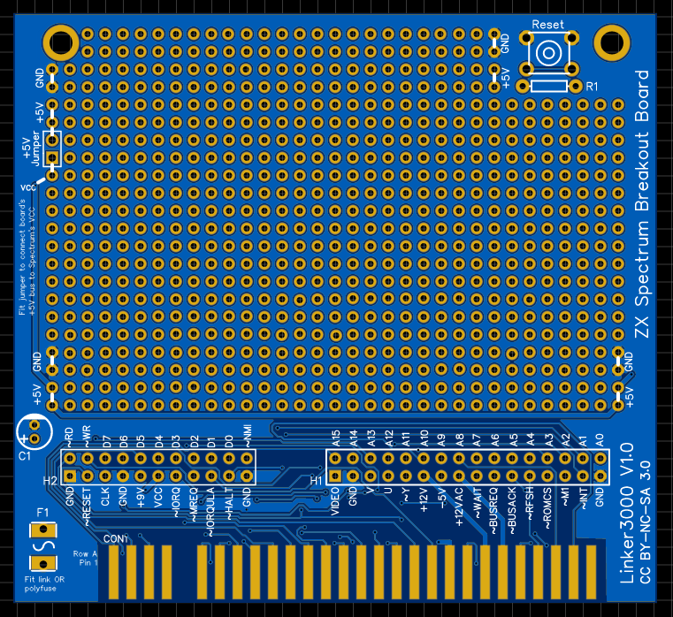
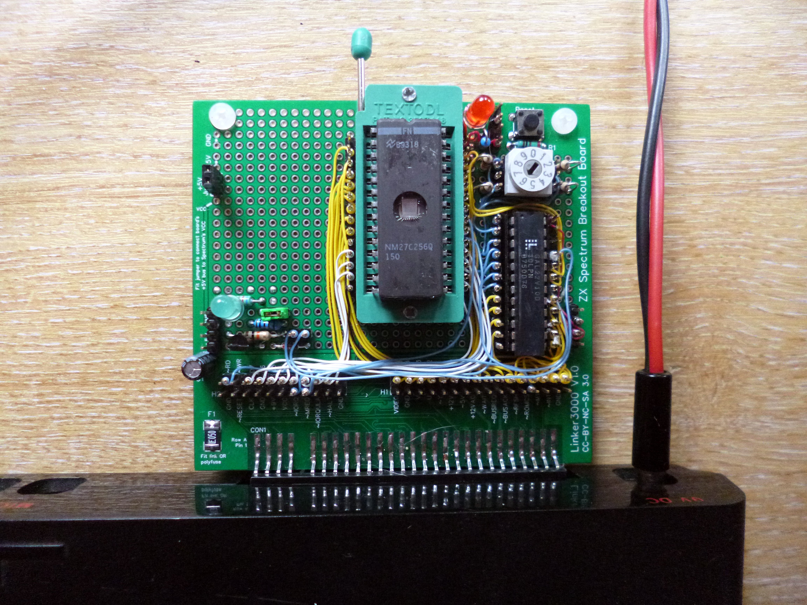
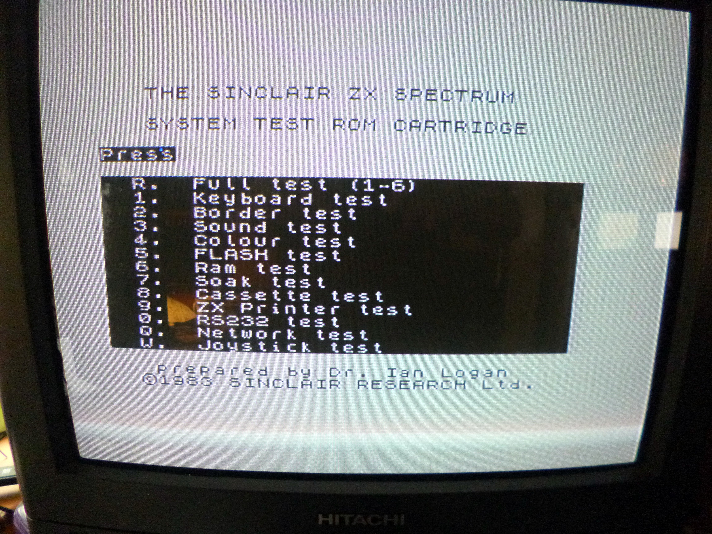
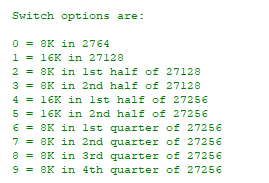

**This is a hobby project and comes with no official support. The PCB schematic and board design files are offered 'as is' with no claims made about their fitness for any specific purpose. Use at your own risk.**

# ZX-Spectrum-Breakout-Board

A plug-in PCB for the ZX Spectrum that can be populated with your own project.

## Features:
* Breaks out the ZX Spectrum edge connector onto a prototyping PCB.
* Allows direct wiring to the ZX Spectrum expansion bus or pin headers can be fitted for probing or wire wrapping.
* Room for (optional) reset switch.
* 5V/0V points around the edge of the prototyping area.
* Room for an optional polyfuse to protect the ZX Spectrum from power mishaps on the board.
* Place for bulk decoupling capacitor (suggest 100uF at 16V or 10V).

The board design files are available to all at the following address. Copies of the board can be ordered directly from that site or the files taken to your favourite PCB manufacturer.

https://easyeda.com/linker3000/ZXBreakout

## Use notes
* Designed and tested with an Issue 2 48K ZX Spectrum and should work with any model that has an identical expansion interface.
* As for any ZX Spectrum expansion cartridge or interface, never connect or disconnect it while the host computer is powered up because this can damage one or the other.
* The reset switch grounds the /RESET line on the ZX Spectrum, which shorts a small electrolytic capacitor inside the computer. The reset circuit on this board has room for a (100R) series resistor, which can be fitted to limit the capacitor's discharge current without affecting reset operation. This resistor is optional and really only needed to resolve anyone's angst at shorting out a cap with a tact switch. If not fitted, replace the resistor with a wire link.
* F1 is intended to be a polyfuse with a 500mA current limit. The footprint will support a through-hole or surface mount part (see pic). If not fitting a polyfuse, replace it with a wire link otherwise no power will be routed round the board.
* The +5V Jumper (top left) connects/disconnects ZX Spectrum 5V power from the rest of the board to act as a simple on/off or isolation switch. Replace with a wire link if not needed. Note that the VCC position on the main header connector H2 is directly connected to the Spectrum edge connector and is not isolated by this jumper.
* Plastic PCB pillars can be fitted through the 3mm holes at the top of the board to support the edge and keep the board level when plugged into a ZX Spectrum.
* The board needs to be fitted with a 0.1" (2.54mm) pitch, 56-way edge connector that matches the ZX Spectrum's expansion port; these are getting harder to find and it's common to cut down a longer connector. At the time of writing (July 2020), suitable connectors are available from a couple of vendors on eBay - for example, Retrocomputershack (https://www.ebay.co.uk/itm/Sinclair-ZX-Spectrum-ZX81-Edge-Connector-UNCUT/260906239646), but note that even though those connectors have the required number of contacts, the ends need cutting down because the overall size is too wide to fit the ZX Spectrum's expansion port slot.
* *Always* fit a locating key in the expansion connector because this helps align the contacts and prevents mishaps that short out adjacent contacts which may damage the computer or parts on the expansion board.  

## Example project

**ZX Spectrum ROM cartridge**

This will be written-up as a separate project.

Notes to follow.
